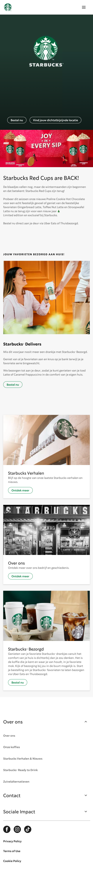
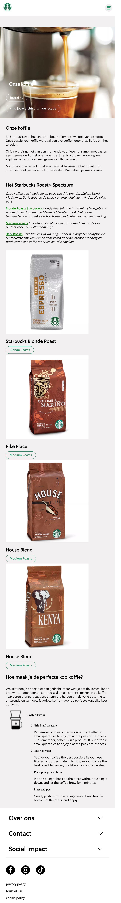
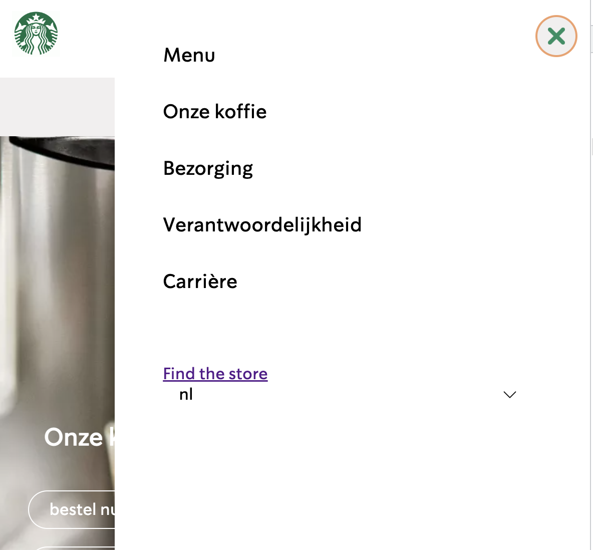
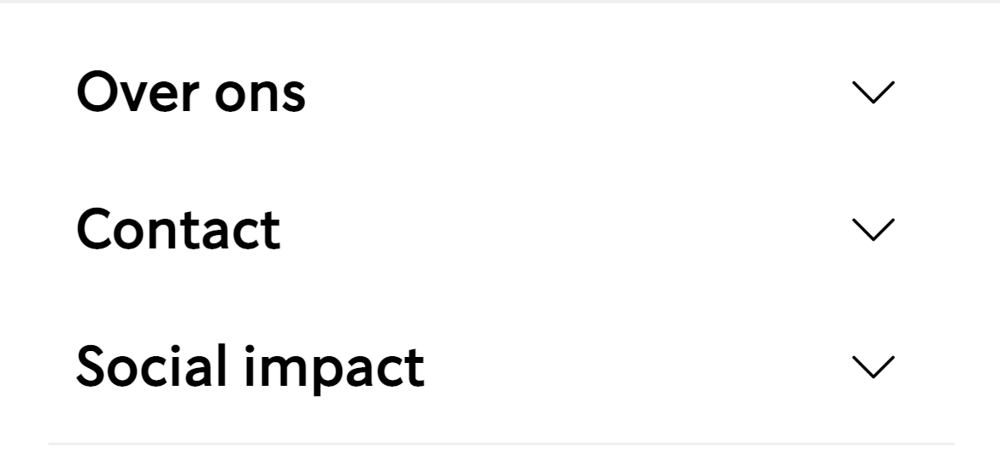
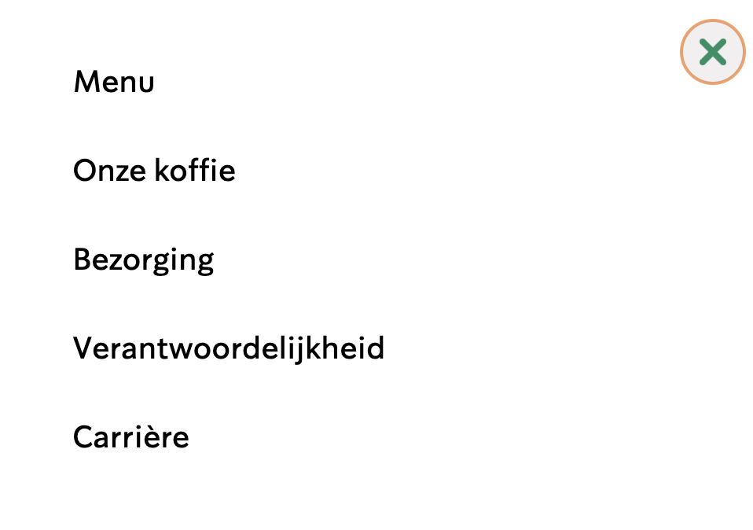

# Procesverslag
Markdown is een simpele manier om HTML te schrijven.  
Markdown cheat cheet: [Hulp bij het schrijven van Markdown](https://github.com/adam-p/markdown-here/wiki/Markdown-Cheatsheet).

Nb. De standaardstructuur en de spartaanse opmaak van de README.md zijn helemaal prima. Het gaat om de inhoud van je procesverslag. Besteedt de tijd voor pracht en praal aan je website.

Nb. Door *open* toe te voegen aan een *details* element kun je deze standaard open zetten. Fijn om dat steeds voor de relevante stuk(ken) te doen.

## Jij

  
uitwerken voor kick-off werkgroep

  ### Auteur:
Nada Saidi

  #### Je startniveau:
  blauw

  #### Je focus:
  responsive
 

## Je website

  
uitwerken voor kick-off werkgroep

  ### Je opdracht:
https://www.starbucks.nl/nl

  #### Screenshot(s) van de eerste pagina (small screen): 

 

  #### Screenshot(s) van de tweede pagina (small screen):

 

## Toegankelijkheidstest 1/2 (week 1)

  
uitwerken na test in 1e werkgroep

  ### Bevindingen
 Tijdens het testen samen met Julia ben ik eracher gekomen dat een aantal dingen niet goed werkte en of onduidelijk waren. De bevinden die mij zijn opgevallen zijn: Er is geen gebruik gemaakt van darkmode,De knoppen zijn best onduidelijk en niet leesbaar. Je krijgt bijna geen feedback , er is geen hover te zien als je erover heen gaat. En wanneer een hover wordt gebruikt, valt het niet op en is heel onduidelijk.

  #### Screenreader
  Tijdens De screenreader was het mij opgevallen dat alles het wel deed, Het was duidelijk wat er werd opgenoemd en wat er gebuerde,
  Hier korte omschrijving (met indien nodig afbeeldingen)

  Hier een omschrijving van hoe het opgelost kan worden (met indien nodig afbeeldingen)
  Er is voor de screenreader geen oplossing nodig omdat alles netjes werkt zoals het hoort te werken.

  #### Muis en Toetsenbord 
De muis en toetsenbord doet het prima, je kan alles met toetsenbord en muis openen, wat jammer is is dat er geen duidelijke hoever aanwezig is of feedback. Zo kan het best onduidelijk zijn hoe het te werk gaat.

  Hier een omschrijving van hoe het opgelost kan worden (met indien nodig afbeeldingen)
Om dit op te lossen is er een mogelijkheid om een hover te gebruiken zo is het duidelijker hoe iets werkt en wat er nou daadwerkelijk gebuerd.

  #### Motoriek (shocks, elastiekjes)
tijdens shocks en elastiekjes merkte ik dat het best wel lastig is om zoiets te besturen vooral bij de footer omdat die heel klein is, dit wil ik veranderen zodat het beter klikbaar is.

  Hier een omschrijving van hoe het opgelost kan worden (met indien nodig afbeeldingen)
Het is een oplossing om de buttons wat groter te maken zo is het makkelijker klikbaar en kun je de knoppen haast niet missen als je een shock krijgt.

  #### Visueel (brillen, contrast, kleurenblind, dark/light). 
De webiste is goed te bekijken, er is geen dark mode aanwezig wat wel jammer is. Het is fijn om zoiets te gebruiker omdat de webiste van starbucks veel witte afbeeldingen bevat die heel helder en duidelijk zijn.

  Hier een omschrijving van hoe het opgelost kan worden (met indien nodig afbeeldingen)
Als oplossing zou kunnen zijn dat er een darkmode in komt. IK heb zelf responsive gekozen waardoor ik me meer ga focussen op andere elementen dan dark en light mode.

## Breakdownschets (week 1)

  
uitwerken na afloop 2e werkgroep

  ### de hele pagina: 
  

>

  ### dynamisch deel (bijv menu): 
 

  ### wellicht nog een dynamisch deel (bijv filter): 
  
  
  

## Voortgang 1 (week 2)

  
uitwerken voor 1e voortgang

  ### Stand van zaken

Deze week ging wel oke vond ik zelf, Ik merkte dat ik het best lastig vond om een start te maken en om te kijken hoe ik nou zo'n site kon maken. Ik heb nog niet veel kunnen doen omdat ik best nog veel vragen heb. Ik vind het best moeilijk om een start te maken .

  <!-- hier dit ging goed & dit was lastig (neem ook screenshots op van delen van je website en code) -->

  ### Agenda voor meeting
  samen met je groepje opstellen

  1.  Aaminah: Ik zou graag willen weten of er een tijdschema is voor de website, of dat we zelf volledig het tempo bepalen." 
  | 2. Aamninah en nada  Ik wil graag bespreken of mijn html in orde is.
  | 3. Nada; Ik weet nog niet helemaal hoe ik het bovenste gedeelte van de 2e pagina in elkaar zit kwa html
    4. Ik wil iets laten scrollen, maar de srollbar moet niet zichtbaar zijn. Ook wil ik graag weten hoe ik een timer op een carousel/slider kan zetten met een counter erbij.

  ### Verslag van meeting
  hier na afloop snel de uitkomsten van de meeting vastleggen

 Tijdens de feedback gesprekken zijn alle punten besproken en we zijn goed aangestuurd door de docent om verder te werken aan de code.

 ik wou graag me html bespreken om te kijken of de opzet zelf wel goed is en wat ik kan veranderen om het nog beter te maken. Aaminah wou een slider erin zetten de docent hielp hierbij en antwoorde de vragen die zij nodig had.

 Wij waren tevreden met de feedback en konden gelijk verder

## Voortgang 2 (week 3)

  
uitwerken voor 2e voortgang

  ### Stand van zaken
 Ik ben nu verder gekomen met mijn site en ben enorm te vreden met wat ik heb kunnen maken. Ik ben enorm blij met mijn hamburger menu en ik kan niet geloven dat dit mijn gelukt is . Ik ben echt trots met hoe ver ik al ben gekomen met weinig kennis.

  ### Agenda voor meeting
  samen met je groepje opstellen

  
  Aaminah :Ik wil graag weten hoe ik een infinite slider kan maken met een timer en een counter die laat zien welke img van de slider te zien is
  nada: Ik wil graag weten hoe je een scrollbar weghaald
  Nada: Ik wil graag weten hoe je een stuk tekst halverwege kan laten stoppen en meer tekst laat zien wanneer het scherm groter wordt

 
  ### Verslag van meeting
  hier na afloop snel de uitkomsten van de meeting vastleggen
Na de feedback gesprekken heb ik en duidelijker beeld gekregen van hoe ik een teskt anders kan positioneren door grid toe te passen.Ook heeft de docent voorbeelden van codes gestuurd zodat ik dit kan overnemen en beter kan bekijken als dat nodig is.

## Toegankelijkheidstest 2/2 (week 4)

  
uitwerken na test in 8e werkgroep

  	
			
			
			

  ### Bevindingen
  ik heb mijn site weer getest en ik zag zeker een verbetering erin, Klikken gaat beter met iemand die bijv parkison heeft,er is een beter hover ingezet. En de h1 die ik heb is verborgen maar wordt wel opgelezen ineen screenreader
  #### Screenreader
  Tijdens de screenreader liep ik eerst tegen een probleem aan de h1 werd niet opgenoemd en deed het dus niet bij de screenreader

  Hier een omschrijving van hoe het opgelost kan worden (met indien nodig afbeeldingen)

  Dit is opgelost omdat het niet was connectmet de style css, kleine vergissing  maar dat leidde toch veel onduidelijkheid dit is wel goed opgelost uiteindelijk

  #### Muis en Toetsenbord 
  Hier korte omschrijving (met indien nodig afbeeldingen)

  Hier een omschrijving van hoe het opgelost kan worden (met indien nodig afbeeldingen)

  #### Motoriek (shocks, elastiekjes)
Alles was makkelijk en goed te bedienen, geen problemen mee gehad.

  Hier een omschrijving van hoe het opgelost kan worden (met indien nodig afbeeldingen)
 Niet nodig

  #### Visueel (brillen, contrast, kleurenblind, dark/light). 
Er is geen gebruik gemaakt van een darkmode en ik heb dit ook nog niet kunnen toepassen, dit is zeker jammer maar daar ben ik helaas nog niet aan toe gekomen.

  Hier een omschrijving van hoe het opgelost kan worden (met indien nodig afbeeldingen)
  Door een darkmode toe te passen kan het fijner leesbaar zijn voor iemand die het wat te helder vind.

## Voortgang 3 (week 4)

  
uitwerken voor 3e voortgang

  ### Stand van zaken
Deze week ging best goed, de uitklabre footer is mooi gelukt en ben er erg tevreden mee. Wat minder ging was de grid , dit lukte mij steeds niet , ik kreeg hem niet volledig breedt en niet zoals het hoorde, Ik vond dit zo lastig een een aantal traantjes laten vallen.

  ### Agenda voor meeting
  samen met je groepje opstellen

  Aaminah: Ik wil graag weten hoe ik een infinite slider kan maken met een timer en een counter die laat zien welke img van de slider te zien is

  Aamninah: k wil graag weten hoe je een scrollbar weghaald

Nada& Aaminah : Ik wil graag weten hoe je een stuk tekst halverwege kan laten stoppen en meer tekst laat zien wanneer het scherm groter wordt

Aaminah: Ik zou graag willen weten of de HTML van mijn navigatie semantisch correct is.
Nada : Hoe krijg ik een grid breed.

  ### Verslag van meeting
 Tijdens het gesprek ging het wel goed, ik heb antwoord gekregen op bijna alle vragen, helaas is het grid gedeelte niet benatwoord en is het lastig haaalbaar voor mij, toch geef ik niet op en zal proberen alsnog een manier te vinden.

## Eindgesprek (week 5)

  
uitwerken voor eindgesprek

  ### Je uitkomst - karakteristiek screenshots:
  

  ### Dit ging goed/Heb ik geleerd: 
  Korte omschrijving met plaatjes

Ik heb tijdens het coderen ondanks ik echt heel veel moeite mee heb best veel dingen waar ik trots op ben. Het is gelukt om als eerst een knop in een plaatje te zetten, Ook is gelukt om een hamburger menu in te zetten. Ik ben heel trots op wat ik heb gemaakt. vooral omdat ik erg veel moeite heb.

  ### Dit was lastig/Is niet gelukt:
Tijdens het coderen liep ik tegen een aantal dingen aan, 1 hiervan is dat de talen menu niet gelukt is , ik vond dit heel lastig en jammer maar ik heb het wel gerobeerd.

Ook lukte het niet om  de buttoms allemaal een kleur te geven bij het tabben. Dit vond ik heel lastig om te doen.

## Bronnenlijst

  1. https://codepen.io/shooft/pen/KKeGEye 
  2.footer uitklaps: https://codepen.io/shooft/pen/zYamYyx
  3. buttons: https://codepen.io/shooft/pen/YzvOYLO
  4.responsive grid https://codepen.io/shooft/pen/gOKzzBM
  5.foto met tekst: https://codepen.io/shooft/pen/jOKzRoK
  6.dingen accessible verbergen en een skip to content link: https://codepen.io/shooft/pen/wvXpRwe
  7. voor de states:https://www.w3schools.com/cssref/sel_hover.php

